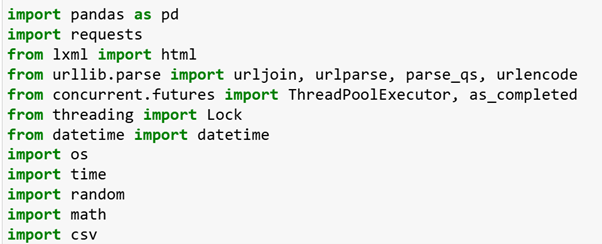
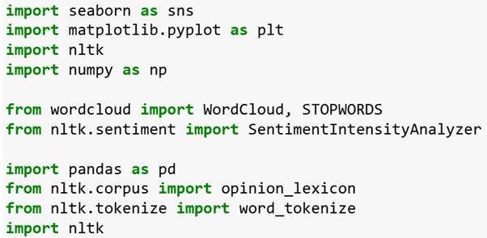
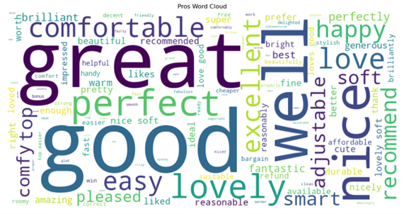
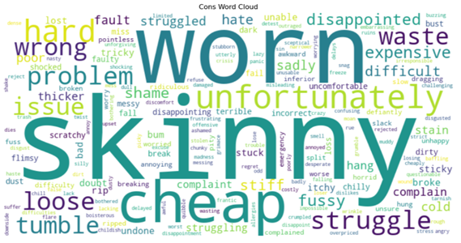
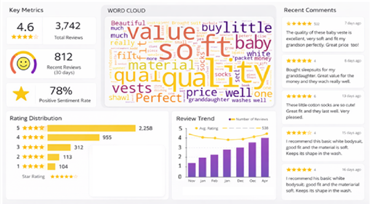

# Customer Reviews Sentiment Analysis

## Executive Summary

Retail product reviews left online can be overwhelming to a potential customer due to the sheer volume and polarisation, in this project natural language processing techniques analyse customer sentiment to determine if reviews for specific categories of products on a leading UK clothing retailer were positive or negative. Key themes were picked from all reviews using word clouds to quickly convey key messages to the end-user.  
This project aims to convert large amounts of unstructured textual data (reviews) into structured analytics-ready data in order to allow end-users to drive actionable insights. The goal is to demonstrate how an analytical and evidence-based approach can be used to deliver insights in a retail environment. The analytical approach used is transparent and repeatable however it should be noted that sentiment classification can fail to capture the nuance of complex customer responses.  
Overall, the project was successful with clear and actionable insights delivered in a user-friendly format, with repeatable and transparent results. If productionised by a retail business there is a clear outline of how a dashboard can be laid out. This project has analysed six categories of childrenswear products but is scalable to analyse larger ranges of products across a multi-faceted business.  

## Data Infrastructure & Tools
The products in each category of clothing on the website were scraped using Python, with each currently available product’s option number being saved to a csv. The product reviews used for sentiment analysis were then captured using Python to connect to the API of PowerReviews for these option numbers.

   
Figure 1 - Libraries used in Python for getting product reviews.

Python was also used for the sentiment analysis and subsequent creation of word clouds.  

   
Figure 2 - Libraries used in Python for sentiment analysis and creating word clouds.  

Python provides an easy to use platform with extensive libraries for text analytics. It allows others to reproduce results, offers integration with data visualisation and business intelligence tools, and also has strong community and academic support. It can however be slow when scaled up to process large datasets and also requires a level of technical expertise to operate, meaning care must be taken when explaining the processes to non-technical stakeholders.

## Data Engineering
Due to all the data used into this project being hosted online on public websites there is not a typical extract/transform/load process. Data was extracted using Python to connect to the Power Reviews API, during this process care was taken to avoid too many requests to the API, with delays being added between each request, this is inline with the documentation online provided by PowerReviews. Due to these delays and the number of products online and subsequent volume of reviews the extract portion of this pipeline was very time consuming.  
Due to the unstructured, noisy and informal nature of the data several preprocessing steps were applied including conversion of text to lowercase, removal of punctuation and common stop words (such as “the”, “and” and “is”), then using Python’s Natural Language ToolKit (NLTK) each review was tokenised in order to perform sentiment analysis. This means splitting text into meaningful units for further analysis.

## Data Visualisation & Dashboards
The results of the sentiment analysis were displayed in a simple table quickly showing the spread of sentiments as well as the % of positive reviews for each category. This quickly allows users to identify areas for concern i.e. baby accessories has a low % of positive reviews, although it’s also immediately noticeable that the sample size is lower.

   
Figure 3 - Final results of sentiment analysis on six Childrenswear categories.

Alongside the overall sentiments word clouds for positive and negative sentiments were split out. These visuals showcase the most common themes amongst reviews where more mentions of a word results in a larger font size for that word.

   
Figure 4 – Word cloud of positive words for Schoolwear

   
Figure 5 – Word cloud of negative words for Schoolwear

Below is a draft of a dashboard to show reviews information, this would be particularly useful for the  buying & merchandising functions of a retail business, as they would be able to pick out areas of product failure or success with an emphasis on recency. This could be segmented with slicers to select product categories, features, or recency.

   
Figure 6 - A mock-up of a PowerBI dashboard to show recent reviews, review sentiment and themes over time.

## Data Analytics
By applying Natural Language Processing (NLP) techniques the goal of this analysis was to quantify positive and negative customer sentiment across different categories of clothing. The dataset consisted of unstructured text reviews.  
Sentiment analysis was implemented using NLTK’s VADER (Valence Aware Dictionary and sEntiment Reasoner), a lexicon and rule-based algorithm that is trained on social media text, which makes it suitable for short and informal consumer text such as product reviews.  
VADER assigns a compound score based on predefined words mapped to polarity scores with rules that account for modifiers such as “very” or “extremely”, while maintaining negative handling such as “not good”. This score is between -1 and +1, with scores of ≥ 0.05 being positive, ≤ 0.05 being negative and otherwise neutral. These thresholds follow the standard practice advised by Hutto and Gilbert.   
This approach provides easy interpretability with explainable results however it is sensitive to context (some key words may be positive on one category and negative on another, such as “thin” material). There is also an issue with sarcasm being improperly recognised. Reducing longer reviews to a binary outcome of positive/negative may mask issues with products or complaints about a portion of received service, i.e. the product is great but delivery was an issue.  
Once each review was scored these results were aggregated across product categories, transforming unstructured text data into a structured analytical output that can be used for visualisation and business reports.  
Customer names were not retained when retrieving data from the API as this could breach data governance regulations.   
Further analysis could include aspect-based sentiment analysis to determine sentiment about different characteristics such as fit, price, quality, or delivery separately. The reviews could also be segmented to get insights into customer sentiment on yellow products, extra large sizes, or any other characteristics within the product metadata.

# [⬅ Back to Portfolio](../README.md)
